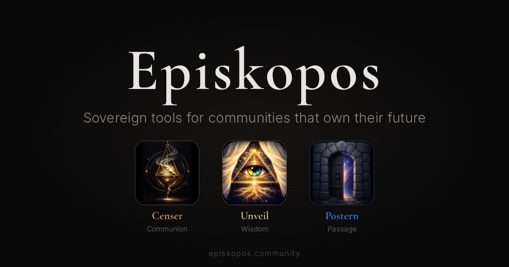

<div align="center">
  

  <h1>Episkopos Community</h1>
  <em>Sovereign tools for communities that own their future</em>

  <p>
    <a href="https://work.episkopos.community/episkopos/community/-/pipelines"></a>
    
  </p>

  <h3>
    <a href="https://episkopos.community">episkopos.community</a>
  </h3>
</div>

A suite of sovereign, self-hosted tools for online communities. Episkopos puts
ownership back in the hands of the people who use it — no platform lock-in, no
data extraction, no compromises.

Based on [Stoat](https://github.com/stoatchat/stoatchat), an open-source chat platform.

**Part of the [Episkopos](https://episkopos.community) suite** — sovereign tools for communities.

This repository is the development hub and source of truth for:
- Bug Reports
- Feature Requests
- UX Feedback
- Security Reports

## Products

<!-- Censer -->

<div align="center">
  
</div>

<table>
  <tr>
    <td width="140" align="center">
      <a href="https://censer.chat" target="_blank"></a>
    </td>
    <td>
      <h3><a href="https://censer.chat" target="_blank">Censer</a></h3>
      <em>The Sacred Vessel of Communication</em><br><br>
      Real-time chat platform built for communities that refuse to rent their conversations from corporations. Self-hosted, federated-ready, and fully open source.
    </td>
  </tr>
</table>

<!-- Unveil -->

<div align="center">
  
</div>

<table>
  <tr>
    <td width="140" align="center">
      <a href="https://unveil.community" target="_blank"></a>
    </td>
    <td>
      <h3><a href="https://unveil.community" target="_blank">Unveil</a></h3>
      <em>Draw Back the Veil</em><br><br>
      Community knowledge browser that surfaces collective wisdom. Browse, search, and preserve the conversations and decisions that define your community.
    </td>
  </tr>
</table>

<!-- Postern -->

<div align="center">
  
</div>

<table>
  <tr>
    <td width="140" align="center">
      <a href="https://dashboard.episkopos.community" target="_blank"></a>
    </td>
    <td>
      <h3><a href="https://dashboard.episkopos.community" target="_blank">Postern</a></h3>
      <em>The Quiet Side Gate</em><br><br>
      Migration and synchronisation tool that lets communities leave legacy platforms on their own terms. Export, transform, and import — no data left behind.
    </td>
  </tr>
</table>

## Quick Links

| | |
|---|---|
| **Landing site** | [episkopos.community](https://episkopos.community) |
| **GitLab** | [work.episkopos.community/episkopos](https://work.episkopos.community/episkopos) |
| **GitHub mirror** | [github.com/episk-pos](https://github.com/episk-pos) |
| **Contact** | [contact@episkopos.community](mailto:contact@episkopos.community) |

## Repositories

| Repository | Product | Description |
|------------|---------|-------------|
| [censer-web](https://work.episkopos.community/episkopos/censer-web) | Censer | Web client (SolidJS + Vite) |
| [censer-backend](https://work.episkopos.community/episkopos/censer-backend) | Censer | API server (Rust) |
| [censer-flutter](https://work.episkopos.community/episkopos/censer-flutter) | Censer | Mobile client (Flutter) |
| [censer-sdk-dart](https://work.episkopos.community/episkopos/censer-sdk-dart) | Censer | Dart SDK |
| [unveil](https://work.episkopos.community/episkopos/unveil) | Unveil | Knowledge archive (Elixir + Phoenix) |
| [postern](https://work.episkopos.community/episkopos/postern) | Postern | Migration tool (TypeScript) |

## Service Status

Check real-time service health at **[status.episkopos.community](https://status.episkopos.community)**.

## Where To File Issues
Use **GitHub Issues** in this repository.

1. [Open `New issue`](https://work.episkopos.community/episkopos/community/-/issues/new)
2. Choose a template
3. Fill all required sections

Available templates:
- `Bug Report`
- `Feature Request`
- `UX Feedback`
- `Security Issue`

## Before Opening A New Issue
1. Search existing issues to avoid duplicates.
2. Confirm behavior on the latest available build.
3. Collect evidence:
   - Reproduction steps
   - Screenshots or video
   - Environment details (OS, client, version)
   - Logs or error messages

## Bug Reports
Good bug reports include:

1. Clear summary of the problem
2. Exact reproduction steps
3. Expected vs actual behavior
4. Frequency, severity, and workaround
5. Environment + evidence

Use the `Bug Report` template.

## Feature Requests
Strong feature requests include:

1. User problem being solved
2. Desired outcome
3. Proposed solution
4. Alternatives considered
5. Scope and impact
6. Acceptance criteria

Use the `Feature Request` template.

## UX Feedback
Use `UX Feedback` when reporting friction, confusion, or usability issues that may not be strict bugs.

Helpful UX submissions include:
- Current experience and pain points
- Suggested improvement
- Why it matters to users
- Supporting examples and references

## Security Reports
Use `Security Issue` for vulnerabilities.

If the report includes sensitive exploit details, do not post proof-of-concept details publicly. Provide impact and reproduction at a safe level so maintainers can coordinate remediation.

## Triage Flow
Maintainers will generally:

1. Validate scope and request missing information
2. Apply labels (`type`, `priority`, `severity`, `area`, `status`)
3. Deduplicate and link related issues
4. Move accepted issues into planning/in progress

Higher-quality issue submissions reduce triage turnaround time.

## Dev Stack

A full local development environment lives in [`dev/`](dev/). It runs the entire Censer backend (powered by Stoat: Delta, Bonfire, Autumn, January) and infrastructure (MongoDB, Redis, MinIO, RabbitMQ, Maildev) locally, with the frontend Vite dev server running natively for fast HMR.

**Two modes are available:**

- **Kind/K8s** (default) — Full Kubernetes cluster via Kind + Tilt. Best for production-parity testing.
- **Docker Compose** — Lighter alternative, no Kind cluster needed. Good for quick iteration and CI.

Both modes use the same ports, same images, and same Tilt UI.

### Prerequisites

**All modes:**
- [Docker](https://docs.docker.com/get-docker/)
- [just](https://github.com/casey/just)
- [Rust / Cargo](https://rustup.rs/) (or use `--prebuilt` to skip)

**Kind/K8s mode (adds):**
- [Kind](https://kind.sigs.k8s.io/)
- [Tilt](https://docs.tilt.dev/install.html)
- [kubectl](https://kubernetes.io/docs/tasks/tools/)

**Compose via Tilt (adds):**
- [Tilt](https://docs.tilt.dev/install.html)

**Plain Compose mode:** Docker only (no Tilt, Kind, or kubectl needed).

### Quick Start

```bash
cd dev/

# --- Kind/K8s mode (default) ---
just setup    # Check prerequisites, create Kind cluster
just up       # Start everything (Tilt UI opens)

# --- Docker Compose via Tilt ---
just up-compose          # Same Tilt UI, Docker Compose backend

# --- Plain Docker Compose (no Tilt) ---
just compose-up          # Start all services
just compose-seed        # Seed test data
just compose-down        # Stop everything
```

If the backend (`censer-backend/`) or frontend (`censer-web/`) directories aren't cloned as siblings, the Tilt UI will show clone buttons to set them up automatically.

### Commands

| Command | Description |
|---------|-------------|
| **Kind/K8s mode** | |
| `just setup` | Check prerequisites, create Kind cluster |
| `just up` | Start the full dev stack via Tilt + Kind |
| `just up-prebuilt` | Start with pre-built images (no Rust needed) |
| `just down` | Stop Tilt (cluster stays intact) |
| `just nuke` | Delete the Kind cluster entirely |
| **Docker Compose mode** | |
| `just up-compose` | Start dev stack via Tilt + Compose |
| `just up-compose-prebuilt` | Compose + pre-built images |
| `just compose-up` | Plain `docker compose up` (no Tilt) |
| `just compose-down` | Stop Compose services |
| `just compose-seed` | Seed test data (Compose mode) |
| **Shared** | |
| `just test` | Run frontend E2E tests against the stack |
| `just status` | Show cluster, pods, and Tilt resources |
| `just logs <service>` | Tail logs for a service (e.g., `delta`) |

### Ports

All services use the `14xxx` range to avoid conflicts with other dev stacks (Fray.run, execos, etc.) that may run concurrently.

| Port | Service |
|------|---------|
| 5173 | Frontend (Vite dev server, local) |
| 5174 | Flutter frontend (web, local) |
| 14702 | Delta (API) |
| 14703 | Bonfire (WebSocket) |
| 14704 | Autumn (file server) |
| 14705 | January (embed proxy) |
| 14717 | MongoDB (debug) |
| 14672 | RabbitMQ management UI (debug) |
| 14080 | Maildev web UI (debug) |
| 14009 | MinIO API (debug) |
| 14001 | MinIO console (Compose only) |

### Architecture

```
┌─────────────────────────────────────────────────┐
│  Host                                           │
│  ┌───────────────┐  ┌──────────────────┐        │
│  │ Vite dev :5173│  │ Flutter dev :5174│        │
│  └───────────────┘  └──────────────────┘        │
│                                                 │
│  ┌─ Kind cluster (kind-censer) ──────────────┐  │
│  │  namespace: censer                        │  │
│  │                                           │  │    Kind/K8s
│  │  delta:14702  bonfire:14703               │  │      mode
│  │  autumn:14704  january:14705              │  │
│  │                                           │  │
│  │  redis  mongodb  minio  rabbitmq  maildev │  │
│  └───────────────────────────────────────────┘  │
│                  — or —                         │
│  ┌─ Docker Compose ──────────────────────────┐  │
│  │                                           │  │
│  │  delta:14702  bonfire:14703               │  │    Compose
│  │  autumn:14704  january:14705              │  │      mode
│  │                                           │  │
│  │  redis  mongodb  minio  rabbitmq  maildev │  │
│  └───────────────────────────────────────────┘  │
└─────────────────────────────────────────────────┘
```

Backend binaries are built on the host with `cargo build --release`, then packaged into thin Docker images. In Kind mode, images are loaded into the cluster via `kind load`. In Compose mode, images are built directly by `docker compose build`.
